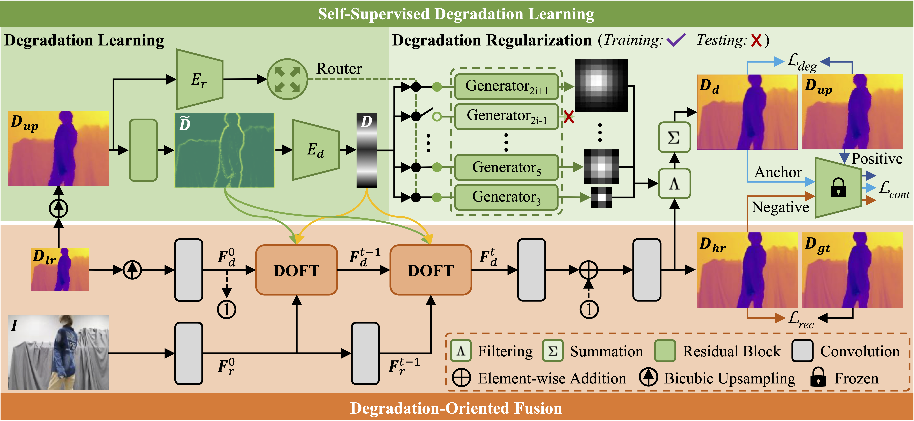
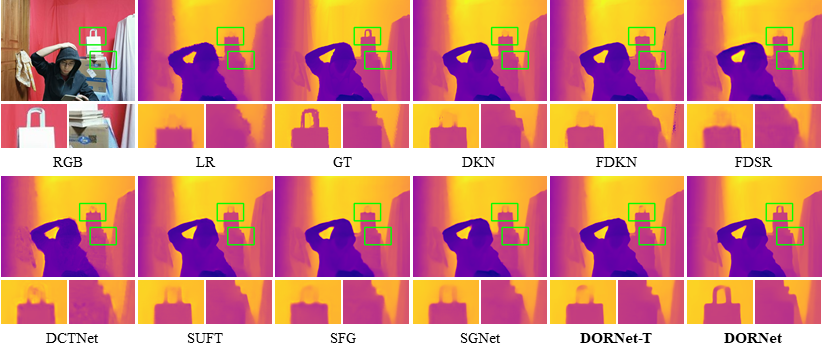

<h2 align="center"> :boom: The model.py will be released once the paper is accepted :boom: </h2>

<p align="center">
<h3 align="center"> Degradation Oriented and Regularized Network for <br> Real-World Depth Super-Resolution 
<br>
CVPR 2025
</h3>
  
<p align="center"><a href="https://scholar.google.com/citations?user=VogTuQkAAAAJ&hl=zh-CN">Zhengxue Wang</a><sup>1*</sup>, 
<a href="https://yanzq95.github.io/">Zhiqiang Yan✉</a><sup>1*</sup>, 
<a href="https://jspan.github.io/">Jinshan Pan</a><sup>1</sup>,
<a href="https://guangweigao.github.io/">Guangwei Gao</a><sup>2</sup>,
<a href="https://cszn.github.io/">Kai Zhang</a><sup>3</sup>,
  <a href="https://scholar.google.com/citations?user=6CIDtZQAAAAJ&hl=zh-CN">Jian Yang✉</a><sup>1</sup>  <!--&Dagger;-->
</p>

<p align="center">
  <sup>*</sup>Equal contribution&nbsp;&nbsp;&nbsp;
  <sup>✉</sup>Corresponding author&nbsp;&nbsp;&nbsp;<br>
  <sup>1</sup>Nanjing University of Science and Technology&nbsp;&nbsp;&nbsp;
  <br>
  <sup>2</sup>Nanjing University of Posts and Telecommunications&nbsp;&nbsp;&nbsp;
  <sup>3</sup>Nanjing University&nbsp;&nbsp;&nbsp;
</p>

<p align="center">

</p>


Overview of DORNet. Given $\boldsymbol D_{up}$ as input, the degradation learning first encodes it to produce degradation representations $\boldsymbol {\tilde{D}}$  and $\boldsymbol D $. Then, $\boldsymbol {\tilde{D}}$,  $\boldsymbol D $, $\boldsymbol D_{lr} $, and $\boldsymbol I_{r}$ are fed into multiple degradation-oriented feature transformation (DOFT) modules, generating the HR depth $\boldsymbol D_{hr}$. Finally, $\boldsymbol D$ and $\boldsymbol D_{hr}$ are sent to the degradation regularization to obtain $\boldsymbol D_{d}$, which is used as input for the degradation loss $\mathcal L_{deg}$ and the contrastive loss $\mathcal L_{cont}$. The degradation regularization only applies during training and adds no extra overhead in testing.

## Dependencies

```bash
Python==3.11.5
PyTorch==2.1.0
numpy==1.23.5 
torchvision==0.16.0
scipy==1.11.3
Pillow==10.0.1
tqdm==4.65.0
scikit-image==0.21.0
mmcv-full==1.7.2
```

## Datasets

[RGB-D-D](https://github.com/lingzhi96/RGB-D-D-Dataset)

[TOFDSR](https://yanzq95.github.io/projectpage/TOFDC/index.html)

[NYU-v2](https://cs.nyu.edu/~fergus/datasets/nyu_depth_v2.html)

## Models

Pretrained models on RGB-D-D can be found in  <a href="https://github.com/anonymousdsr/DORNet/tree/main/checkpoints">checkpoints</a> (The remaining pre-trained models will be released once the paper is accepted).


## Training

### DORNet

```
Train on real-world RGB-D-D and TOFDSR
> python train.py
Train on synthetic NYU-v2
> python train.py --scale 4
```

### DORNet-T

```
Train on real-world RGB-D-D and TOFDSR
> python train.py --tiny_model
Train on synthetic NYU-v2
> python train.py --scale 4 --tiny_model
```

## Testing

### SPFNet

```
Test on real-world RGB-D-D and TOFDSR
> python test.py
Test on synthetic NYU-v2
> python test.py --scale 4
```

### SPFNet-T

```
Test on real-world RGB-D-D and TOFDSR
> python test.py --tiny_model
Test on synthetic NYU-v2
> python test.py --scale 4 --tiny_model
```

## Experiments

### Quantitative comparison

<p align="center">

<br>
Complexity on RGB-D-D (w/o Noisy) tested by a 4090 GPU. A larger circle diameter indicates a higher inference time.
</p>


### Visual comparison

<p align="center">

<br>
Visual results on the real-world RGB-D-D dataset (w/o Noise).
</p>

